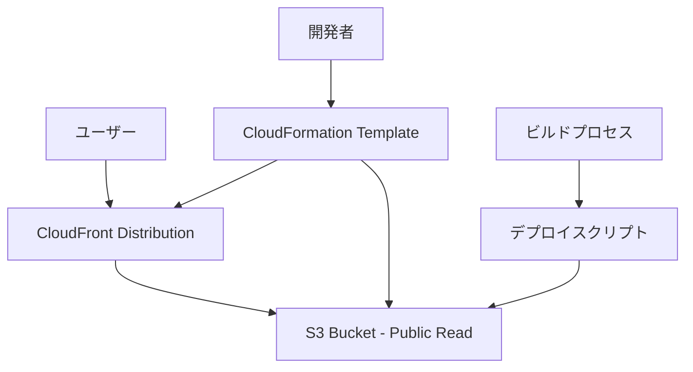

# 設計書

## 概要

NoOpinionButtonWebアプリケーションをAWS S3とCloudFrontを使用してデプロイするためのシンプルなInfrastructure as Code (IaC)ソリューションです。CloudFormationテンプレートを使用してインフラストラクチャを管理し、Nuxt.jsアプリケーションの静的ファイルを配信します。

## アーキテクチャ

### 高レベルアーキテクチャ



### コンポーネント構成

1. **CloudFormation Stack**
   - S3バケット（静的ウェブサイトホスティング用、パブリック読み取り可能）
   - CloudFrontディストリビューション

2. **ビルド・デプロイパイプライン**
   - Nuxt.js静的サイト生成
   - S3へのファイルアップロード

## コンポーネントとインターフェース

### CloudFormationテンプレート構造

#### パラメータ
- `ProjectName`: プロジェクト名（デフォルト: NoOpinionButtonWeb）

#### リソース
1. **S3Bucket**: 静的ウェブサイトホスティング用バケット（パブリック読み取り可能）
2. **CloudFrontDistribution**: CDN配信用ディストリビューション

#### 出力
- `S3BucketName`: 作成されたS3バケット名
- `CloudFrontDistributionId`: CloudFrontディストリビューションID
- `CloudFrontDomainName`: アクセス用ドメイン名

### プロジェクト構造

```
NoOpinionButtonWeb/
├── infrastructure/           # CDKプロジェクト
│   ├── bin/
│   │   └── web-deployment.ts
│   ├── lib/
│   │   └── web-deployment-stack.ts
│   ├── package.json
│   ├── cdk.json
│   └── tsconfig.json
├── scripts/                  # デプロイスクリプト
│   ├── build.sh
│   ├── deploy.sh
│   └── deploy-infrastructure.sh
└── (既存のNuxtファイル)
```

### デプロイスクリプト構造

#### ビルドスクリプト (`NoOpinionButtonWeb/scripts/build.sh`)
```bash
#!/bin/bash
# Nuxt.jsアプリケーションのビルド
npm ci
npm run generate
```

#### インフラデプロイスクリプト (`NoOpinionButtonWeb/scripts/deploy-infrastructure.sh`)
```bash
#!/bin/bash
# CDKスタックのデプロイ
cd infrastructure
npm ci
npx cdk deploy
```

#### アプリデプロイスクリプト (`NoOpinionButtonWeb/scripts/deploy.sh`)
```bash
#!/bin/bash
# S3へのファイルアップロード
aws s3 sync ./dist/ s3://$BUCKET_NAME/ --delete
```

## データモデル

### CloudFormationテンプレートの設定値

#### S3バケット設定
- **WebsiteConfiguration**: インデックスドキュメント（index.html）とエラードキュメント（index.html）
- **PublicReadPolicy**: パブリック読み取りアクセスを許可

#### CloudFront設定
- **Origins**: S3ウェブサイトエンドポイントをオリジンとして設定
- **DefaultCacheBehavior**: 基本的なキャッシュ動作
- **CustomErrorResponses**: 404エラーをindex.htmlにリダイレクト（SPAサポート）

### キャッシュ戦略

#### シンプルなキャッシュ設定
- **デフォルトキャッシュ**: CloudFrontのデフォルト設定を使用
- **エラーハンドリング**: 404エラーを200ステータスでindex.htmlにリダイレクト

## エラーハンドリング

### CloudFormationデプロイエラー
1. **スタック作成失敗**: ロールバック機能により自動的にリソースをクリーンアップ
2. **リソース名重複**: ユニークなバケット名生成で回避

### デプロイスクリプトエラー
1. **ビルド失敗**: エラーメッセージを表示して処理を停止
2. **S3アップロード失敗**: AWS CLIのエラーハンドリングを活用

### ランタイムエラー
1. **404エラー**: CloudFrontカスタムエラーページでindex.htmlにリダイレクト（SPAサポート）

## テスト戦略

### 基本テスト
1. **デプロイテスト**
   - CloudFormationスタックの作成確認
   - リソース作成の確認

2. **機能テスト**
   - CloudFrontドメインでのアクセス確認
   - 各ページの表示確認
   - SPAルーティングの動作確認