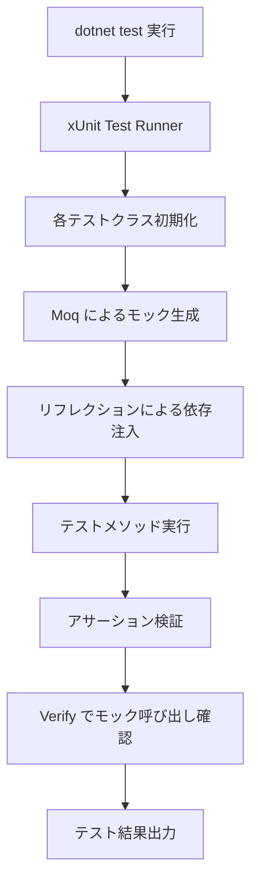
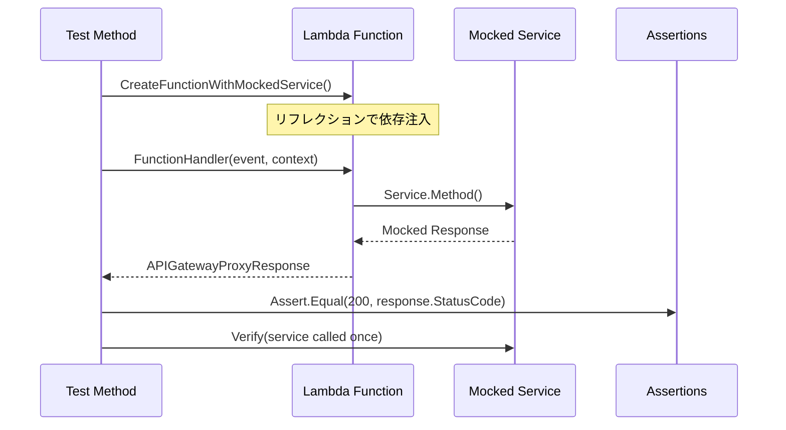
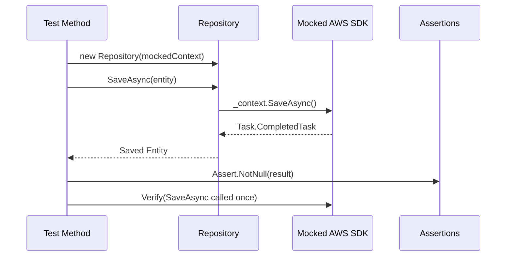
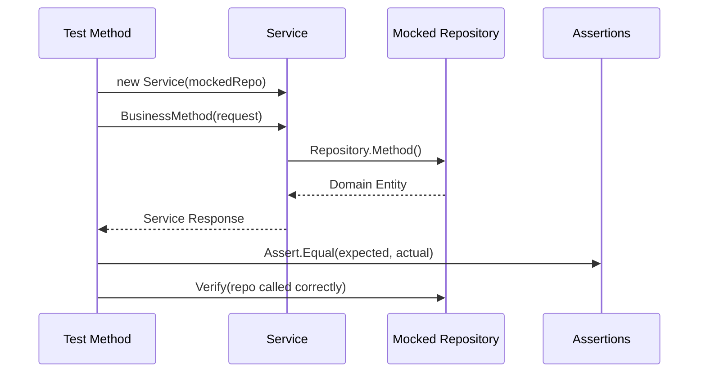
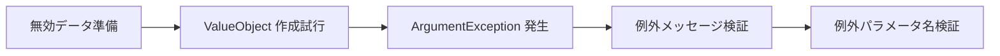
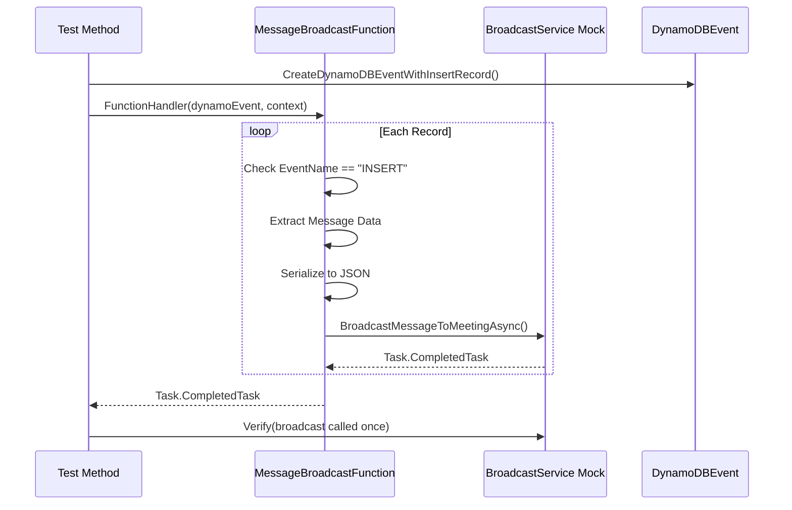
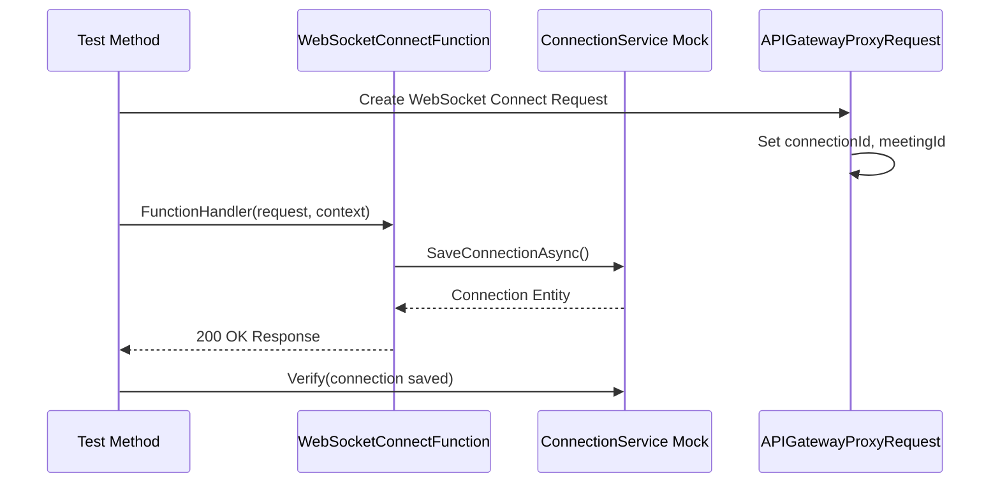
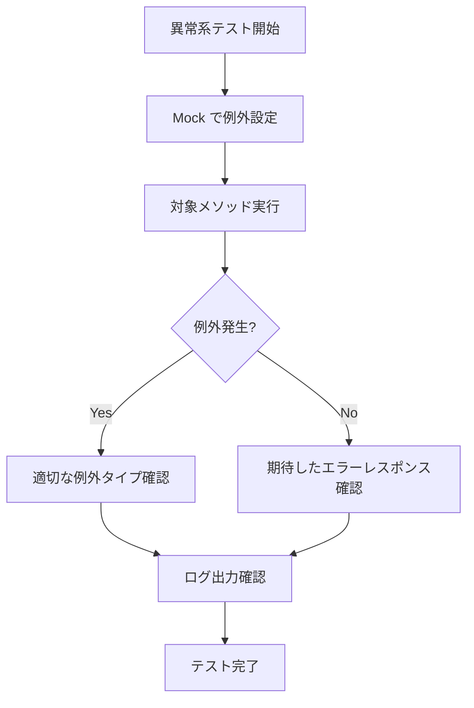
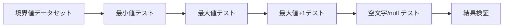
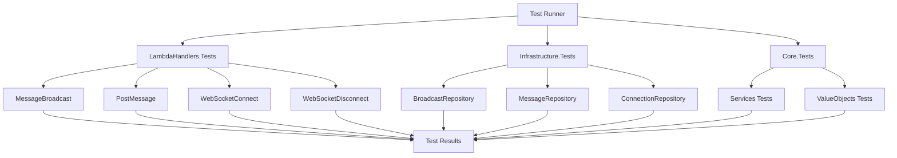

# テストデータフロー図

## テスト実行フロー全体像



## レイヤー別テストフロー

### Lambda Handler層テストフロー



### Infrastructure層テストフロー



### Core層テストフロー



## ValueObjects テストフロー

### 正常系テストパターン

```mermaid
flowchart LR
    A[テストデータ準備] --> B[ValueObject 作成]
    B --> C[値の検証]
    C --> D[暗黙的変換テスト]
    D --> E[ToString() テスト]
    E --> F[Equality テスト]
```

### 異常系テストパターン



## DynamoDB Streams イベントテストフロー



## WebSocket 接続テストフロー



## エラー処理テストフロー



## 境界値テストフロー



## テスト並列実行フロー

