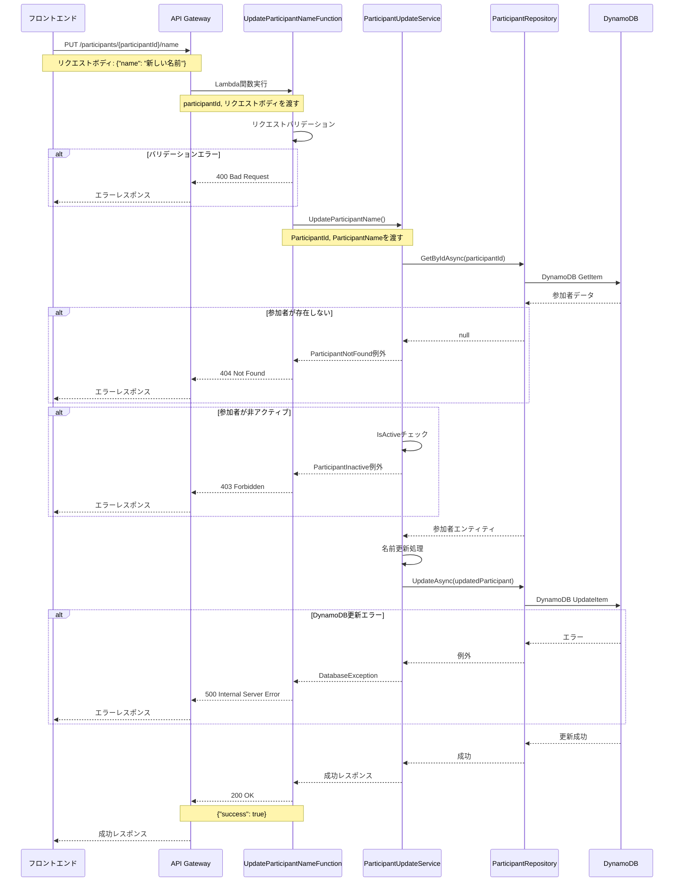
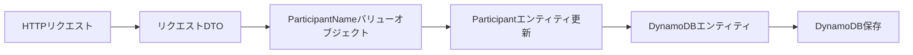
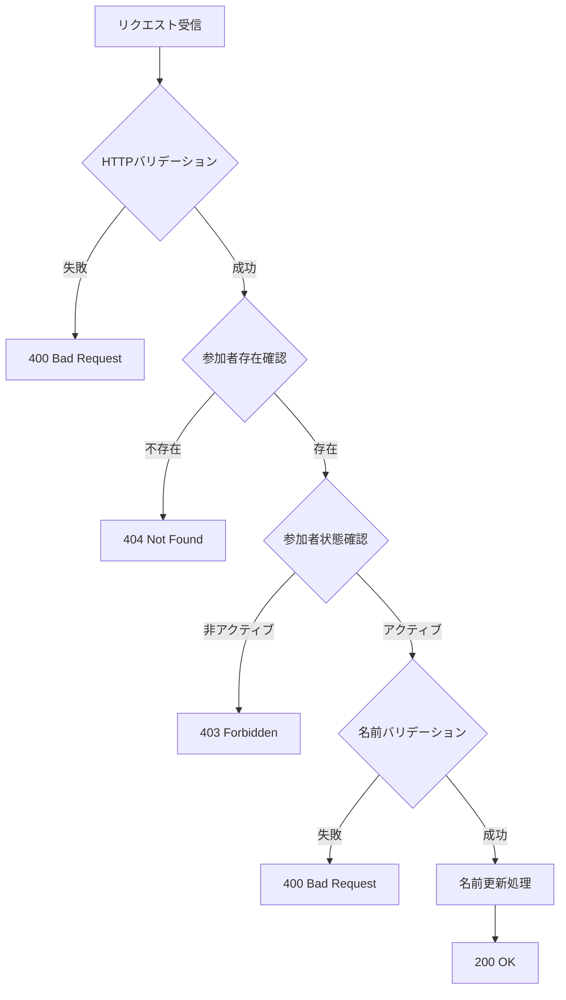
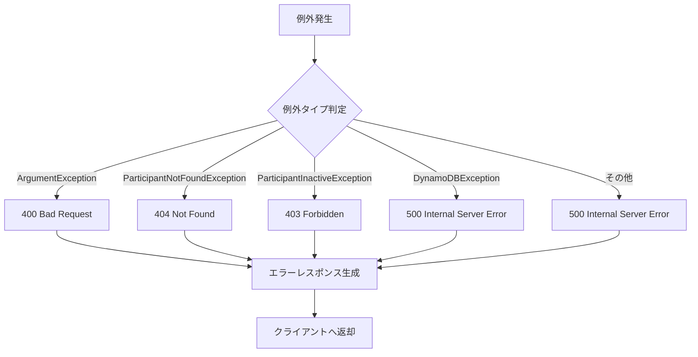

# Participant名前登録API データフロー設計

## システム相互作用フロー

```mermaid
flowchart TD
    A[フロントエンド] -->|PUT /participants/{id}/name| B[API Gateway]
    B --> C[UpdateParticipantNameFunction]
    C --> D[ParticipantUpdateService]
    D --> E[ParticipantRepository]
    E --> F[DynamoDB]
    
    F -->|結果| E
    E -->|結果| D
    D -->|結果| C
    C -->|HTTPレスポンス| B
    B -->|HTTPレスポンス| A
```

## 詳細な処理シーケンス



## データ処理フロー

### 1. 入力データの流れ


### 2. バリデーション処理フロー


### 3. エラーハンドリングフロー
