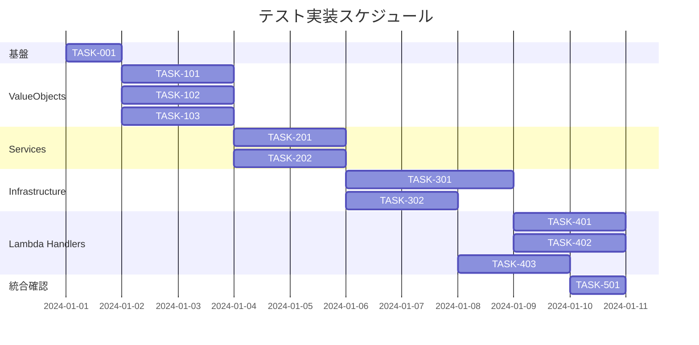

# メッセージ・WebSocket接続管理 単体テスト実装タスク

## 概要

全タスク数: 16
推定作業時間: 20-24時間
クリティカルパス: TASK-001 → TASK-101 → TASK-201 → TASK-301

## タスク一覧

### フェーズ1: 基盤構築・準備作業

#### TASK-001: テスト環境・パターン確認

- [x] **タスク完了**
- **タスクタイプ**: DIRECT
- **要件リンク**: REQ-101, REQ-403
- **依存タスク**: なし
- **実装詳細**:
  - 既存SignInテストパターンの詳細分析
  - テストプロジェクト構造確認
  - 必要なNuGetパッケージ確認
  - テスト命名規則・コード規約の統一
- **完了条件**:
  - [ ] SignInテストの実装パターンが分析済み
  - [ ] テストプロジェクト構造が理解済み
  - [ ] 必要な依存関係が確認済み

### フェーズ2: Core層（Domain ValueObjects）テスト実装

#### TASK-101: Message関連 ValueObjects テスト

- [x] **タスク完了**
- **タスクタイプ**: TDD
- **要件リンク**: REQ-011, REQ-012, REQ-013, REQ-014
- **依存タスク**: TASK-001
- **実装詳細**:
  - MessageIdTests.cs の作成
  - MessageContentTests.cs の作成（500文字境界値含む）
  - LikeCountTests.cs の作成
  - ReportedCountTests.cs の作成
- **テスト要件**:
  - [ ] 単体テスト: コンストラクタ正常系
  - [ ] 単体テスト: コンストラクタ異常系（ArgumentException）
  - [ ] 単体テスト: 暗黙的変換（string ⇔ ValueObject）
  - [ ] 単体テスト: ToString() メソッド
  - [ ] 境界値テスト: MessageContent 500文字制限
- **エラーハンドリング**:
  - [ ] null値での例外処理
  - [ ] 空文字列での例外処理
  - [ ] 制限値超過での例外処理

#### TASK-102: Participant関連 ValueObjects テスト

- [x] **タスク完了**
- **タスクタイプ**: TDD
- **要件リンク**: REQ-015, REQ-016, REQ-017
- **依存タスク**: TASK-001
- **実装詳細**:
  - ParticipantIdTests.cs の作成
  - ParticipantNameTests.cs の作成
  - NoOpinionPointTests.cs の作成（MaxPoint=2境界値含む）
- **テスト要件**:
  - [ ] 単体テスト: 各ValueObjectの正常系・異常系
  - [ ] 境界値テスト: NoOpinionPoint 0-2制限
  - [ ] 統合テスト: 暗黙的変換の組み合わせテスト
- **エラーハンドリング**:
  - [ ] 負の値での例外処理
  - [ ] 制限値超過での例外処理

#### TASK-103: Meeting・Connection関連 ValueObjects テスト

- [x] **タスク完了**
- **タスクタイプ**: TDD
- **要件リンク**: REQ-018, REQ-019, REQ-020, REQ-021, REQ-022
- **依存タスク**: TASK-001
- **実装詳細**:
  - MeetingIdTests.cs, MeetingNameTests.cs の作成
  - FacilitatorPasswordTests.cs, ParticipantPasswordTests.cs の作成
  - ConnectionIdTests.cs の作成
- **テスト要件**:
  - [ ] 単体テスト: 各ValueObjectの正常系・異常系
  - [ ] セキュリティテスト: パスワード関連ValueObjects
  - [ ] 統合テスト: ID系ValueObjects の一意性

### フェーズ3: Core層（Application Services）テスト実装

#### TASK-201: MessageService テスト

- [ ] **タスク完了**
- **タスクタイプ**: TDD
- **要件リンク**: REQ-008
- **依存タスク**: TASK-101
- **実装詳細**:
  - MessageServiceTests.cs の作成
  - Repository層のモック化（Moq使用）
  - 正常系・異常系テストケース実装
- **テスト要件**:
  - [ ] 単体テスト: メッセージ送信処理
  - [ ] 単体テスト: ビジネスルール検証
  - [ ] 統合テスト: Repository連携
- **エラーハンドリング**:
  - [ ] Repository例外での適切な例外再スロー
  - [ ] 無効なメッセージ内容での例外処理

#### TASK-202: ConnectionService・BroadcastService テスト

- [ ] **タスク完了**
- **タスクタイプ**: TDD
- **要件リンク**: REQ-009, REQ-010
- **依存タスク**: TASK-103
- **実装詳細**:
  - ConnectionServiceTests.cs の作成
  - BroadcastServiceTests.cs の作成
  - Repository層のモック化
- **テスト要件**:
  - [ ] 単体テスト: WebSocket接続管理ロジック
  - [ ] 単体テスト: メッセージブロードキャストロジック
  - [ ] 統合テスト: 接続・切断フロー

### フェーズ4: Infrastructure層テスト実装

#### TASK-301: BroadcastRepository テスト

- [ ] **タスク完了**
- **タスクタイプ**: TDD
- **要件リンク**: REQ-005
- **依存タスク**: TASK-202
- **実装詳細**:
  - BroadcastRepositoryTests.cs の作成
  - AmazonApiGatewayManagementApiClient のモック化
  - WebSocket送信処理のテスト
- **テスト要件**:
  - [ ] 単体テスト: 単一接続への配信
  - [ ] 単体テスト: 複数接続への並列配信
  - [ ] 統合テスト: AWS SDK連携
- **エラーハンドリング**:
  - [ ] GoneException処理（切断済み接続）
  - [ ] 一般的なAWS SDK例外処理
  - [ ] 環境変数未設定での例外処理

#### TASK-302: MessageRepository・ConnectionRepository テスト

- [ ] **タスク完了**
- **タスクタイプ**: TDD
- **要件リンク**: REQ-006, REQ-007
- **依存タスク**: TASK-202
- **実装詳細**:
  - MessageRepositoryTests.cs の作成
  - ConnectionRepositoryTests.cs の作成
  - IDynamoDBContext のモック化
- **テスト要件**:
  - [ ] 単体テスト: DynamoDB保存処理
  - [ ] 単体テスト: DynamoDB取得・検索処理
  - [ ] 統合テスト: エンティティ変換処理
- **エラーハンドリング**:
  - [ ] DynamoDB接続エラー
  - [ ] データ変換エラー

### フェーズ5: Lambda Handler層テスト実装

#### TASK-401: MessageBroadcastFunction テスト

- [ ] **タスク完了**
- **タスクタイプ**: TDD
- **要件リンク**: REQ-001, REQ-102
- **依存タスク**: TASK-301
- **実装詳細**:
  - MessageBroadcastFunctionTests.cs の作成
  - DynamoDBEvent テストデータファクトリー作成
  - BroadcastService のリフレクション注入
- **テスト要件**:
  - [ ] 単体テスト: INSERT イベント処理
  - [ ] 単体テスト: MODIFY/REMOVE イベントスキップ
  - [ ] 統合テスト: JSON シリアライゼーション
- **エラーハンドリング**:
  - [ ] 不正なDynamoDBイベントデータ
  - [ ] BroadcastService例外の再スロー
  - [ ] ログ出力の確認

#### TASK-402: PostMessageFunction テスト

- [ ] **タスク完了**
- **タスクタイプ**: TDD
- **要件リンク**: REQ-002, REQ-103
- **依存タスク**: TASK-301
- **実装詳細**:
  - PostMessageFunctionTests.cs の作成
  - APIGatewayProxyRequest テストデータファクトリー作成
  - MessageService のリフレクション注入
- **テスト要件**:
  - [ ] 単体テスト: POST /message 正常処理
  - [ ] 単体テスト: OPTIONS CORS処理
  - [ ] 統合テスト: JSON リクエスト/レスポンス
- **エラーハンドリング**:
  - [ ] 不正なJSONリクエスト
  - [ ] 必須フィールド欠如
  - [ ] MessageService例外処理

#### TASK-403: WebSocket接続管理Function テスト

- [ ] **タスク完了**
- **タスクタイプ**: TDD
- **要件リンク**: REQ-003, REQ-004, REQ-103
- **依存タスク**: TASK-302
- **実装詳細**:
  - WebSocketConnectFunctionTests.cs の作成
  - WebSocketDisconnectFunctionTests.cs の作成
  - ConnectionService のリフレクション注入
- **テスト要件**:
  - [ ] 単体テスト: WebSocket接続処理
  - [ ] 単体テスト: WebSocket切断処理
  - [ ] 統合テスト: クエリパラメータ処理
- **エラーハンドリング**:
  - [ ] 無効な接続ID
  - [ ] ConnectionService例外処理

### フェーズ6: 統合・品質確認

#### TASK-501: テスト実行・品質確認

- [ ] **タスク完了**
- **タスクタイプ**: DIRECT
- **要件リンク**: 全要件
- **依存タスク**: TASK-401, TASK-402, TASK-403
- **実装詳細**:
  - 全テストの実行確認（`dotnet test`）
  - テストカバレッジの確認
  - テスト実行時間の測定
  - CI/CD統合確認
- **テスト要件**:
  - [ ] 全テストが正常実行される
  - [ ] テスト間の依存関係がない
  - [ ] 並列実行が可能である
- **完了条件**:
  - [ ] 全16テストクラスが実装済み
  - [ ] 全テストが成功する
  - [ ] テスト実行時間が要件を満たす

## 実行順序

## 並列実行可能タスク

### 第1波: ValueObjects（並列実行可能）
- TASK-101: Message関連 ValueObjects
- TASK-102: Participant関連 ValueObjects  
- TASK-103: Meeting・Connection関連 ValueObjects

### 第2波: Services（並列実行可能）
- TASK-201: MessageService
- TASK-202: ConnectionService・BroadcastService

### 第3波: Infrastructure（並列実行可能）
- TASK-301: BroadcastRepository
- TASK-302: MessageRepository・ConnectionRepository

### 第4波: Lambda Handlers（並列実行可能）
- TASK-401: MessageBroadcastFunction
- TASK-402: PostMessageFunction
- TASK-403: WebSocket接続管理Functions

## 重要な実装ポイント

### SignInテストパターン踏襲
- リフレクションによる依存注入パターン
- Moqによるモック化戦略
- 日本語テストメソッド命名規則
- 正常系・異常系・境界値の網羅

### AWS SDK・DynamoDB モック化戦略
- `AmazonApiGatewayManagementApiClient` のモック
- `IDynamoDBContext` のモック
- `PostToConnectionRequest` のテストデータ生成
- `DynamoDBEvent` のファクトリーパターン

### テスト品質保証
- 各テストの独立実行可能性
- 決定論的テスト結果
- エラーハンドリングの完全網羅
- ログ出力の検証