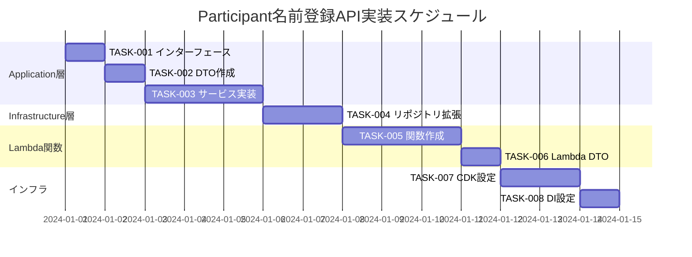

# Participant名前登録API 実装タスク

## 概要

全タスク数: 8
推定作業時間: 16時間
クリティカルパス: TASK-001 → TASK-002 → TASK-003 → TASK-004 → TASK-005 → TASK-006 → TASK-007 → TASK-008

## タスク一覧

### フェーズ1: Application層実装

#### TASK-001: ParticipantUpdateServiceインターフェース作成

- [ ] **タスク完了**
- **タスクタイプ**: DIRECT
- **要件リンク**: REQ-003, REQ-401
- **依存タスク**: なし
- **実装詳細**:
  - `IParticipantUpdateService`インターフェース定義
  - `UpdateParticipantNameAsync`メソッドシグネチャ作成
  - XMLドキュメント記述
- **ファイルパス**: `src/Api/Core/Application/Ports/IParticipantUpdateService.cs`
- **完了条件**:
  - [ ] インターフェースが定義されている
  - [ ] XMLドキュメントが記述されている
  - [ ] ビルドエラーがない

#### TASK-002: DTOクラス作成

- [ ] **タスク完了**
- **タスクタイプ**: DIRECT  
- **要件リンク**: REQ-001, REQ-002
- **依存タスク**: なし
- **実装詳細**:
  - `UpdateParticipantNameRequest`DTO作成
  - `UpdateParticipantNameResponse`DTO作成
  - JSONシリアライゼーション属性設定
- **ファイルパス**: 
  - `src/Api/Core/Application/DTOs/Requests/UpdateParticipantNameRequest.cs`
  - `src/Api/Core/Application/DTOs/Responses/UpdateParticipantNameResponse.cs`
- **完了条件**:
  - [ ] リクエストDTOが作成されている
  - [ ] レスポンスDTOが作成されている
  - [ ] JSON属性が適切に設定されている

#### TASK-003: ParticipantUpdateService実装

- [ ] **タスク完了**
- **タスクタイプ**: TDD
- **要件リンク**: REQ-001, REQ-101, REQ-102, REQ-201
- **依存タスク**: TASK-001, TASK-002
- **実装詳細**:
  - 参加者存在確認ロジック
  - 参加者アクティブ状態確認
  - ParticipantNameバリューオブジェクト使用
  - 名前更新処理
- **ファイルパス**: `src/Api/Core/Application/Services/ParticipantUpdateService.cs`
- **テスト要件**:
  - [ ] 単体テスト: 正常な名前更新
  - [ ] 単体テスト: 参加者が存在しない場合
  - [ ] 単体テスト: 参加者が非アクティブな場合
  - [ ] 単体テスト: 無効な名前の場合
  - [ ] モックテスト: リポジトリ層との連携
- **エラーハンドリング**:
  - [ ] ParticipantNotFoundExceptionスロー
  - [ ] ParticipantInactiveExceptionスロー
  - [ ] ArgumentExceptionスロー（無効な名前）

### フェーズ2: Infrastructure層拡張

#### TASK-004: ParticipantRepository拡張

- [ ] **タスク完了**
- **タスクタイプ**: TDD
- **要件リンク**: REQ-001, REQ-103
- **依存タスク**: TASK-003
- **実装詳細**:
  - `UpdateParticipantNameAsync`メソッド追加
  - DynamoDB条件付き更新実装
  - エラーハンドリング強化
- **ファイルパス**: `src/Api/Infrastructure/Repositories/ParticipantRepository.cs`
- **テスト要件**:
  - [ ] 単体テスト: DynamoDB更新成功
  - [ ] 単体テスト: 条件付き更新（存在チェック）
  - [ ] 単体テスト: 条件付き更新（アクティブチェック）
  - [ ] 単体テスト: DynamoDB例外ハンドリング
  - [ ] 統合テスト: 実際のDynamoDB接続
- **DynamoDB操作**:
  - [ ] UpdateExpressionの実装
  - [ ] ConditionExpressionの実装
  - [ ] ExpressionAttributeNames/Valuesの設定

### フェーズ3: Lambda関数実装

#### TASK-005: UpdateParticipantNameFunction作成

- [ ] **タスク完了**
- **タスクタイプ**: TDD
- **要件リンク**: REQ-402, REQ-403
- **依存タスク**: TASK-004
- **実装詳細**:
  - AWS Lambda関数ハンドラー作成
  - API Gateway連携
  - HTTPリクエスト/レスポンス処理
  - DIコンテナ設定
- **ファイルパス**: 
  - `src/Api/LambdaHandlers/UpdateParticipantNameFunction/`
  - `src/Api/LambdaHandlers/UpdateParticipantNameFunction/Function.cs`
- **テスト要件**:
  - [ ] 単体テスト: 正常フロー
  - [ ] 単体テスト: バリデーションエラー
  - [ ] 単体テスト: 404エラー処理
  - [ ] 単体テスト: 403エラー処理
  - [ ] 単体テスト: 500エラー処理
  - [ ] 統合テスト: API Gateway連携
- **エラーハンドリング**:
  - [ ] HTTPステータスコード適切な設定
  - [ ] エラーレスポンス形式統一
  - [ ] ログ出力

#### TASK-006: Lambda関数DTOs作成

- [ ] **タスク完了**
- **タスクタイプ**: DIRECT
- **要件リンク**: REQ-402
- **依存タスク**: TASK-005
- **実装詳細**:
  - Lambda関数専用のリクエスト/レスポンスDTO作成
  - API Gateway連携用の属性設定
- **ファイルパス**: 
  - `src/Api/LambdaHandlers/UpdateParticipantNameFunction/DTOs/UpdateParticipantNameRequest.cs`
  - `src/Api/LambdaHandlers/UpdateParticipantNameFunction/DTOs/UpdateParticipantNameResponse.cs`
- **完了条件**:
  - [ ] Lambda用DTOが作成されている
  - [ ] API Gateway属性が設定されている
  - [ ] Core層DTOとの変換処理が実装されている

### フェーズ4: インフラストラクチャ設定

#### TASK-007: CDK設定更新

- [ ] **タスク完了**
- **タスクタイプ**: DIRECT
- **要件リンク**: REQ-403
- **依存タスク**: TASK-006
- **実装詳細**:
  - 新しいLambda関数をCDKスタックに追加
  - API Gateway エンドポイント設定
  - IAMロール・ポリシー設定
  - DynamoDBアクセス権限付与
- **ファイルパス**: `src/ApiInfra/NoOpinionButtonApiInfraStack.cs`
- **完了条件**:
  - [ ] Lambda関数がCDKに定義されている
  - [ ] API Gatewayルートが設定されている
  - [ ] 必要な権限が付与されている
  - [ ] 環境変数が適切に設定されている

#### TASK-008: DI設定更新

- [ ] **タスク完了**
- **タスクタイプ**: DIRECT
- **要件リンク**: REQ-003
- **依存タスク**: TASK-007
- **実装詳細**:
  - `ParticipantUpdateService`のDI登録
  - 新しいLambda関数での依存関係解決設定
- **ファイルパス**: `src/Api/DependencyInjection/ServiceCollectionExtensions.cs`
- **完了条件**:
  - [ ] サービスがDIコンテナに登録されている
  - [ ] ライフタイム管理が適切に設定されている
  - [ ] Lambda関数で依存注入が動作する

## 実行順序



## 各フェーズの成果物

### フェーズ1完了時
- [ ] IParticipantUpdateServiceインターフェース
- [ ] リクエスト/レスポンスDTO
- [ ] ParticipantUpdateService（テスト付き）

### フェーズ2完了時
- [ ] ParticipantRepository拡張（テスト付き）
- [ ] DynamoDB条件付き更新機能

### フェーズ3完了時
- [ ] UpdateParticipantNameFunction（テスト付き）
- [ ] Lambda専用DTO
- [ ] API Gateway連携

### フェーズ4完了時
- [ ] CDK設定完了
- [ ] DI設定完了
- [ ] デプロイ可能な状態

## テスト戦略

### 単体テスト範囲
- **Core層**: ParticipantUpdateService（業務ロジック）
- **Infrastructure層**: ParticipantRepository（データアクセス）
- **LambdaHandlers層**: UpdateParticipantNameFunction（API）

### 統合テスト範囲
- DynamoDB実接続テスト
- API Gateway統合テスト
- エンドツーエンド API テスト

### テスト実行コマンド
```bash
# 全テスト実行
cd NoOpinionButtonApi
dotnet test

# 特定プロジェクトのテスト実行
dotnet test src/ApiTests/Core.Tests/
dotnet test src/ApiTests/Infrastructure.Tests/
dotnet test src/ApiTests/LambdaHandlers.Tests/
```

## 品質チェックリスト

### コード品質
- [ ] XMLドキュメントが記述されている
- [ ] エラーハンドリングが適切に実装されている
- [ ] ログ出力が適切に設定されている
- [ ] セキュリティ要件が満たされている

### テスト品質  
- [ ] テストカバレッジ80%以上
- [ ] 境界値テストが実装されている
- [ ] 異常系テストが網羅されている
- [ ] モックテストが適切に実装されている

### デプロイ品質
- [ ] CDKデプロイが成功する
- [ ] ローカル実行が可能
- [ ] API仕様書との整合性が取れている
- [ ] パフォーマンス要件を満たしている（3秒以内）

## サブタスクテンプレート適用

### TDDタスク（TASK-003, TASK-004, TASK-005）の詳細プロセス

各TDDタスクは以下の6ステップで実装：

1. **tdd-requirements.md** - 詳細要件定義
2. **tdd-testcases.md** - テストケース作成  
3. **tdd-red.md** - テスト実装（失敗）
4. **tdd-green.md** - 最小実装
5. **tdd-refactor.md** - リファクタリング
6. **tdd-verify-complete.md** - 品質確認

### DIRECTタスク（TASK-001, TASK-002, TASK-006, TASK-007, TASK-008）の詳細プロセス

各DIRECTタスクは以下の2ステップで実装：

1. **direct-setup.md** - 直接実装・設定
2. **direct-verify.md** - 動作確認・品質確認